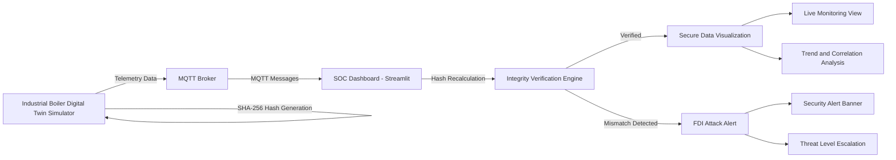

# Boiler Guard  
### Cybersecurity-Aware Industrial IoT Monitoring using MQTT & SHA-256

A **Secure Digital Twin** for an Industrial Boiler that simulates real-time telemetry, transmits data using **MQTT**, and verifies **data integrity using SHA-256 hashing**.  
The system is designed to detect **False Data Injection (FDI) attacks** in Industrial IoT (IIoT) environments and visualize both operational and security insights through a **Streamlit-based SOC dashboard**.

---

## Project Overview

Industrial IoT systems rely heavily on sensor data for safe operation. If this data is manipulated, it can lead to **catastrophic physical consequences**.  
This project demonstrates how **lightweight cryptographic integrity verification** can be integrated into an IoT pipeline to detect malicious data manipulation in real time.

The project simulates:
- A boiler’s temperature & pressure
- Secure telemetry transmission via MQTT
- Real-time integrity verification
- Detection of false data injection attacks

---

## Objectives

- Simulate an industrial boiler using a **Digital Twin**
- Transmit telemetry using **MQTT**
- Ensure **data integrity** using SHA-256 hashing
- Detect **False Data Injection attacks**
- Visualize operational + security insights in real time
- Bridge the gap between **IoT systems and cybersecurity**

---

## System Architecture

### Core Components
- **Boiler Digital Twin Simulator (Publisher)**
- **MQTT Broker (Communication Layer)**
- **SOC Dashboard (Subscriber & Integrity Verifier)**

---

## Architecture Flowchart

## 🔁 Architecture Flowchart

flowchart LR
    A[Industrial Boiler Digital Twin Simulator]
    B[MQTT Broker]
    C[SOC Dashboard - Streamlit]
    D[Integrity Verification Engine]
    E[Secure Data Visualization]
    F[FDI Attack Alert]
    G[Live Monitoring View]
    H[Trend and Correlation Analysis]
    I[Security Alert Banner]
    J[Threat Level Escalation]

## 🔁 Architecture Flowchart


---
## Architecture Explanation

### Digital Twin Simulator
- Simulates boiler temperature and pressure
- Determines system status (**OK / Warning / Critical**)
- Generates **SHA-256 hash** for every telemetry packet
- Publishes data every second using **MQTT**

### MQTT Broker
- Acts as a message relay between publisher and dashboard
- Enables real-time telemetry streaming

### SOC Dashboard
- Subscribes to MQTT topic
- Recalculates hash for each received packet
- Verifies data integrity
- Detects tampering attempts
- Displays operational and security insights

---

## Telemetry Data Model

Each telemetry packet is transmitted in **JSON format**:

```json
{
  "device_id": "boiler_01",
  "timestamp": "2026-01-21T12:30:05Z",
  "temperature": 74.32,
  "pressure": 29.18,
  "status": "OK",
  "hash": "SHA256_HASH_VALUE"
}
```

---

## Hash Generation Policy

The SHA-256 hash is computed using the following fields:

device_id

timestamp

temperature

pressure

status

Any modification to these fields results in a hash mismatch, enabling tamper detection.

## Digital Twin Logic
Telemetry Simulation

Temperature fluctuates within realistic bounds

Pressure is correlated with temperature

Random noise added for realism

Status Logic

OK → Temperature < 85°C and Pressure < 35 PSI

Warning → Temperature ≥ 85°C or Pressure ≥ 35 PSI

Critical → Temperature ≥ 95°C or Pressure ≥ 45 PSI

## SOC Dashboard Features
Live Monitoring

Temperature and Pressure KPI cards

Real-time gauges with threshold indicators

System status display

Security Analysis

Latest packet inspection (raw JSON)

Integrity verification status

Threat level classification (LOW / MEDIUM / HIGH)

Event logs and alerts

Trend & Correlation Analysis

Temperature and pressure trend charts

Combined parameter correlation

Helps distinguish sensor faults from cyber attacks

## False Data Injection (FDI) Attack Simulation
Attack Scenario

Temperature forcibly set to 100°C

Status falsely kept as "OK"

Hash deliberately not updated

Detection Outcome

Hash mismatch detected

Integrity state switches to TAMPERED

Alert banner displayed

Threat level escalated

This confirms successful real-time detection of data manipulation.

## Limitations

Public MQTT broker without authentication

No TLS encryption

Telemetry stored only in memory

Integrity verification ensures integrity, not authenticity

Simulated data only (no physical hardware)

## Future Enhancements

TLS-secured MQTT with certificates

Device authentication

Time-series database integration

Multi-device (fleet) monitoring

AI-based anomaly detection

Role-based access control

Cloud deployment (AWS / Azure IoT)

## Author

Meinam Sanjana Devi
BCA – Cybersecurity
Industrial IoT | Digital Twins | OT Security

## GitHub Repository

🔗 https://github.com/MS123-D/secure-industrial-boiler-digital-twin

## Conclusion

This project demonstrates a security-aware Industrial Digital Twin by combining IoT simulation, real-time monitoring, and cryptographic integrity verification.
It highlights the importance of trustworthy telemetry in safety-critical industrial environments and serves as a strong academic and practical example of secure IIoT system design.


